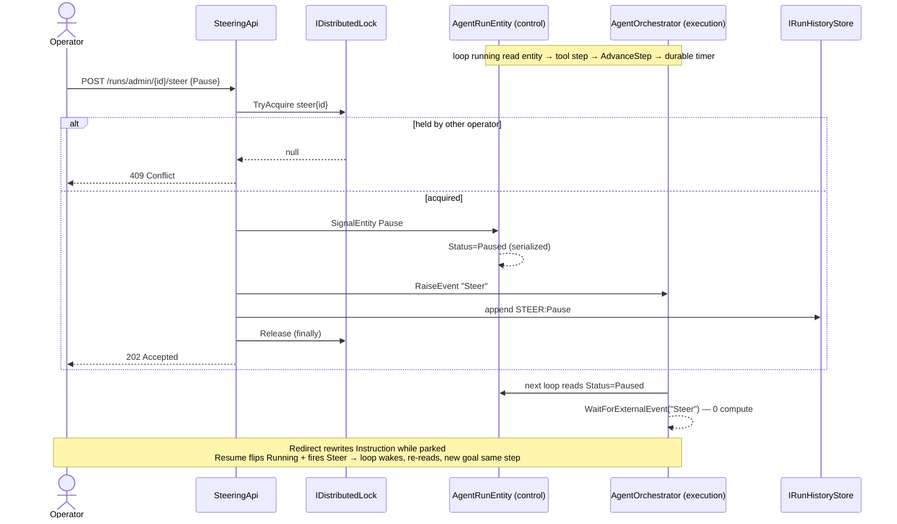
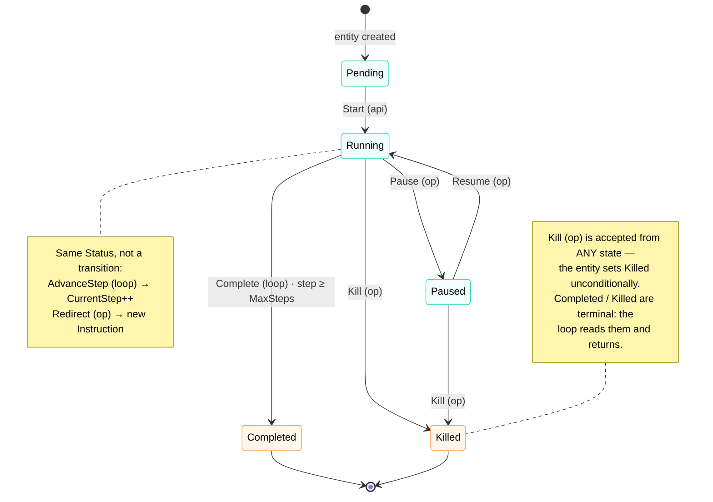

# Architecture

A visual companion to the [Getting Started tour](getting-started.md) and the deep-dive in
[CLAUDE.md](../CLAUDE.md). If you want prose, read those; this page is the maps.

## Component architecture

```mermaid
%%{init: {"flowchart": {"defaultRenderer": "elk"}}}%%
flowchart TB
    classDef indigo stroke:#818cf8,fill:#eef2ff
    classDef teal stroke:#2dd4bf,fill:#f0fdfa
    classDef violet stroke:#a78bfa,fill:#f5f3ff
    classDef orange stroke:#fb923c,fill:#fff7ed
    classDef green stroke:#4ade80,fill:#f0fdf4
    classDef red stroke:#f87171,fill:#fef2f2
    classDef sky stroke:#38bdf8,fill:#f0f9ff
    classDef cyan stroke:#22d3ee,fill:#ecfeff

    OP["Operator / parent system"]:::orange

    subgraph HOST["Azure Functions host (.NET 8 isolated worker)"]
        class HOST indigo
        MW["TelemetryMiddleware<br/>(wraps every invocation: log in/out/fail)"]:::teal

        subgraph CP["CONTROL PLANE — SteeringApi.cs (HTTP, AuthLevel.Function)"]
            class CP violet
            START["POST /runs — StartRun"]:::violet
            STEER["POST /runs/&#123;id&#125;/steer — SteerRun"]:::violet
            GET["GET /runs/&#123;id&#125; — GetRun"]:::violet
            HIST["GET /runs/&#123;id&#125;/history — GetRunHistory"]:::violet
        end

        subgraph DURABLE["Durable Functions"]
            class DURABLE teal
            ENT["AgentRunEntity<br/><b>CONTROL STATE</b> (source of truth)<br/>Status · CurrentStep · Instruction · AuditLog<br/>ops serialized per-entity"]:::cyan
            ORCH["AgentOrchestrator<br/><b>EXECUTION loop</b><br/>read entity → obey → 1 step<br/>Paused = park on event<br/>ContinueAsNew every 5 steps"]:::sky
            ACT["ToolActivities.ExecuteToolStep<br/><b>outside world</b> (non-deterministic)<br/>Polly: Retry→CircuitBreaker→Timeout"]:::green
        end
    end

    subgraph STORES["Services — interface + real + in-memory fallback (picked in Program.cs)"]
        class STORES red
        IDEM["IIdempotencyStore<br/>Redis SET NX EX / in-mem"]:::red
        LOCK["IDistributedLock<br/>Redis SET NX EX + Lua / in-mem"]:::red
        RH["IRunHistoryStore<br/>Cosmos /runId / in-mem"]:::red
    end

    DTS[("Durable storage<br/>Azurite / Azure Storage<br/>checkpoints = survives restart")]:::orange

    OP -->|HTTP /api| CP
    MW -.wraps.- CP

    START -->|"SignalEntity Start"| ENT
    START -->|"ScheduleNewOrchestration"| ORCH
    START -->|claim key| IDEM
    START -->|append START| RH

    STEER -->|"TryAcquire steer:&#123;id&#125; — else 409"| LOCK
    STEER -->|"SignalEntity Pause/Resume/Kill/Redirect"| ENT
    STEER -->|"RaiseEvent 'Steer' (wake)"| ORCH
    STEER -->|append STEER| RH

    GET -->|GetEntity state| ENT
    HIST -->|read events| RH

    ORCH <==>|"read state each loop / signal AdvanceStep,Complete"| ENT
    ORCH -->|"CallActivity 1 step"| ACT
    ACT -->|append STEP| RH

    ENT -.checkpoint.-> DTS
    ORCH -.checkpoint.-> DTS
```

## Steer flow (the core dance)

## Run lifecycle (entity status)

The `Status` field on `AgentRunEntity` moves through these states. Each transition is triggered by
one of three sources — tagged in the labels:

- **(api)** — the `StartRun` HTTP endpoint, once per run.
- **(op)** — an operator steer command (`POST /runs/{id}/steer`): Pause, Resume, Kill, Redirect.
- **(loop)** — the orchestrator itself, as it works: AdvanceStep, Complete.

Two of the entity's operations are **not** transitions — they change progress/instruction but leave
`Status` untouched (shown as the note on `Running`). A run is born in `Pending` the instant the
entity exists; `Start` (signaled right after the orchestration is scheduled) flips it to `Running`.

## Key invariants

- **Split brain by design**: `AgentRunEntity` = *intent*, `AgentOrchestrator` = *action*. Steering
  only mutates the entity; the loop notices on its next read. Race-free by construction.
- **Two guards, different jobs**: idempotency-key stops duplicate *runs* (Start); steer-lock stops
  conflicting *commands* on one run (Steer → 409).
- **Orchestrator stays pure**: no `DateTime.UtcNow` / `Guid.NewGuid` / `Task.Delay` / direct IO. All
  non-determinism + Polly resilience lives in `ToolActivities`. `ContinueAsNew` every 5 steps
  truncates the replay log.
- **Stores swap by connection string** — blank ⇒ in-memory, set ⇒ Redis / Cosmos. No call-site
  change (strategy pattern, wired in `Program.cs`).
